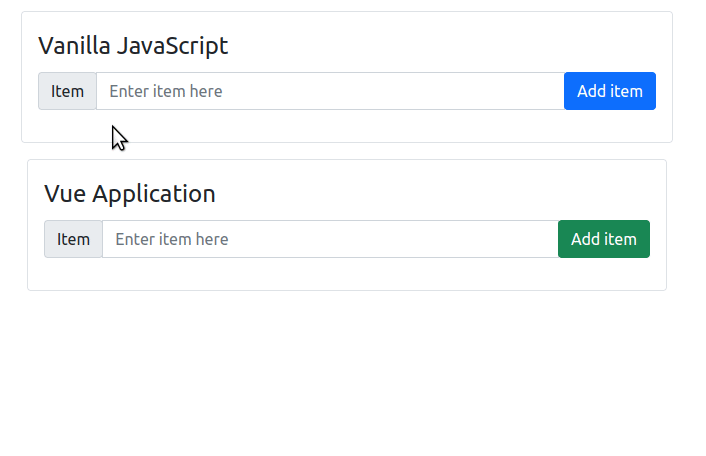

# About
## Objective
 To get an idea of the differences between vanilla JavaScript and Vue.

## Running the Demo
- Double click `index.html` to open the file in your default browser.

# Explanation
## Feature
- If you open `index.html` in the browser, you'll notice two areas: one titled "Vanilla JavaScript", and the other titled, "Vue Application"
- Both areas do the same thing: 
  - If you enter some text in the `<input>` field...
  - and press the "Add Item" button...
  - ...the `<input>` field will be cleared, and the item that was entered will be visible in the list underneath the `<input>`.
- A GIF of the explanation above can be seen below:

## Under the hood: Vanilla JavaScript
- First, let's take a look at [index.html](./index.html), lines 20-41.
  - You'll notice that we have a `<label>`, an `<input>`, a `<button>`, and an empty `<ul></ul>`, as seen below:
  ```html
  <fieldset id="vanilla" class="border rounded p-3 mt-3 col-12 col-md-6 mx-auto">
    <legend>Vanilla JavaScript</legend>

    <!-- Input group -->
    <div class="input-group mb-3">
      <!-- Label -->
      <div class="input-group-prepend">
        <span class="input-group-text">Item</span>
      </div>

      <!-- Input -->
      <input type="text" class="form-control" placeholder="Enter item here">

      <!-- Button-->
      <div class="input-group-append">
        <button class="btn btn-primary" type="button">Add item</button>
      </div>
    </div>

    <!-- List of to-dos -->
    <ul></ul>
  </fieldset>
  ```
- Now, let's take a look at [app.js](./app.js), lines 5-22. To code the above feature in pure, vanilla JavaScript:
  ```javascript
  // Grab the relevant elements from the HTML page
  const buttonElement = document.querySelector('#vanilla button')
  const inputElement = document.querySelector('#vanilla input')
  const listElement = document.querySelector('#vanilla ul')

  // Adds a new item from the text within the <input> into the <ul>
  function addItem() {
    // Get the value of the new item
    const newItem = inputElement.value

    // Create a new <li> element with the new item and append it into the <ul>
    const listItemElement = document.createElement('li')
    listItemElement.textContent = newItem
    listElement.appendChild(listItemElement)

    // Clear the <input>
    inputElement.value = ''
  }
  ```
  - We first grab the relevant elements through `document.querySelector()`
  - We then code the `addItem()` function, which does the following:
    - We get the value that was typed within the `<input>` tag
    - We create a new list element with the value, using `document.createElement()`
    - We then append the new list element into the `<ul>` using `appendChild()`
    - and lastly, we clear the input, removing any text within it.
  - Finally, we link the `<button>` element to the `addItem()` function so that `addItem()` is called when the button is clicked.
- The key takeaway is that with vanilla JavaScript, we write our code *procedurally*:
  - We instruct JavaScript to execute commands such as grabbing elements or linking the button to the function step by step.
  - The problem with writing code this way is that when your application gets bigger, things can get difficult to maintain very fast.

## Under the hood: Vue
- Let's first take a look at [index.html](./index.html), and note the following:
  ```html
  <!-- Line 11: Vue import -->
  <script src="https://unpkg.com/vue@3.4.9/dist/vue.global.js"></script>

  <!-- Lines 45-70 -->
  <!-- Same as VanillaJS portion, but this time using Vue -->
  <div id="app" class="row">
    <fieldset class="border rounded p-3 mt-3 col-12 col-md-6 mx-auto">
      <legend>Vue Application</legend>

      <!-- Input group -->
      <div class="input-group mb-3">
        <!-- Label -->
        <div class="input-group-prepend">
          <span class="input-group-text">Item</span>
        </div>

        <!-- Input -->
        <input type="text" class="form-control" placeholder="Enter item here" v-model="newItem" />

        <!-- Button-->
        <div class="input-group-append">
          <button class="btn btn-success" type="button" @click="addItem">Add item</button>
        </div>
      </div>

      <!-- List of added to-dos -->
      <ul>
        <li v-for="item in list">{{ item }}</li>
      </ul>
    </fieldset>
  </div>

  ```
  - At line 11, we are importing Vue.
  - Line 45: We have a div with `id="app"` (Its [selector](https://www.w3schools.com/cssref/css_selectors.php) is `#app`)
  - Line 57: Our `<input>` tag has a new *directive*: `v-model="newItem"`
  - Line 61: Our `<button>` tag has a new directive: `@click="addItem"`
  - Line 67: `<li>` has a `v-for="item in list"` directive
  - Line 67: Inside the `<li>` is `{{ item }}`

- Now, let's take a look at [app.js](./app.js), lines 31-53:
  ```javascript
  const app = Vue.createApp({
    data() {
      // Declare the object which will contain the data to be used in the app
      // In this case, we need a list of items (an empty array at the moment)
      // and the new item (an empty string at the moment)
      return {
        list: [],
        newItem: ''
      }
    },
    methods: {
      // This function pushes whatever string is contained within the newItem
      // into the list of items. It also clears the newItem string.
      addItem() {
        this.list.push(this.newItem)
        this.newItem = ''
      }
    }
  })

  // Link up the Vue App into the HTML part by specifying the selector 
  // In this case, an element with an ID of 'app'
  app.mount('#app')
  ```
  - Line 31: `const app = Vue.createApp()`
    - We have an object called `Vue`, which is present because we imported Vue in Line 11 of `index.html`.
    - We are calling a function called `createApp()`, which takes in an object, and passing its result to a variable called `app`
  - Lines 32-48 contains the object that we are passing to `createApp()`. The object has the following properties: `data()` and `methods`
    - `data()` is a function returning an **object**. In this case, the object has the following properties:
      - `list`: The list of items, currently an empty array, and is used in line 67 of `index.html`
      - `newItem`: The new item, currently an empty string, and is used in line 57 of `index.html`
    - `methods` is an object returning a function, `addItem()`
      - The `addItem()` function is being used in line 61 of `index.html`
      - Line 45: Inserts the string in `newItem` into the `list` array, displaying it in the `<li>`
      - Line 46: Sets the `newItem` string to an empty string, clearing the input
  - Line 53: We call `app.mount('#app')` to link the Vue application that was just written to the div with `id="app"`

- Key takeaways:
  - Browsers don't know what to do with directives such as `v-model` or `@click`. This is Vue doing its magic.
  - You can have multiple Vue apps within a single HTML page, but each app cannot access the variables and methods of the other Vue apps.
  - In our example, all child HTML elements inside the div with ID `app` are controlled by Vue.

# Conclusions
- Unlike with vanilla JavaScript, which does things procedurally, with Vue, we are doing things *declaratively*.
- We are pretty much declaring rules like, "`newItem` is a string that is linked to the `<input>` tag", or, "If the `<button>` is clicked, call the `addItem()` function."
- In the long run, with a declarative way of writing code, we end up writing less code, which significantly makes large projects easier to maintain.

