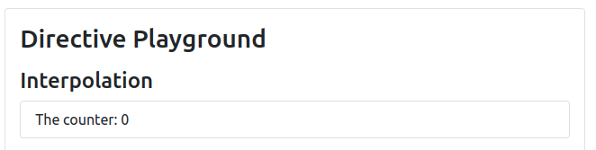
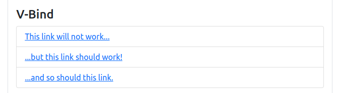
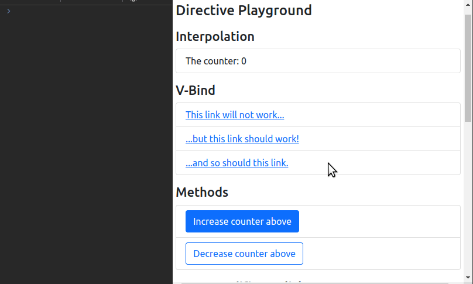
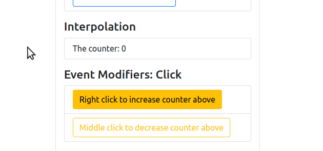
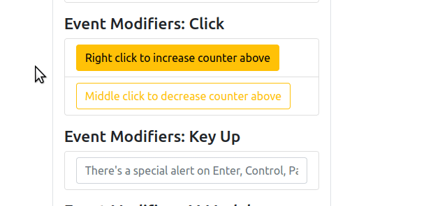
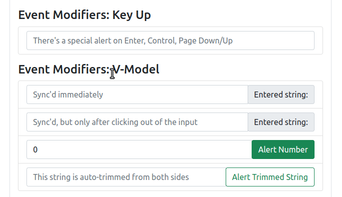
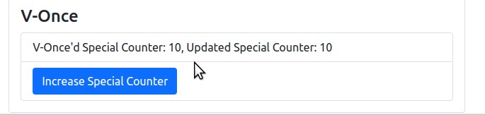

# About
## Objective
To learn a bunch of Vue directives, what they do, and how to use them.

## Running the Demo
- Double click `index.html` to open the file in your default browser.

# Explanation
## Interpolation

- **Relevant files and lines:** 
  - `index.html`: Lines 23-26
  - `app.js`: Line 8
- **Interpolation:**
  - The act of displaying dynamic data into your HTML template
  - This can be done by wrapping variables within two curly braces, like so: `{{ variableName }}`
  - In other words, it *binds the data* from your Vue Application (line 8 of `app.js`) to your template (line 25 of `index.html`) such that any changes made to the variable is automatically reflected in the template.

## V-Bind

- **Relevant files and lines:** 
  - `index.html`: Lines 28-44
  - `app.js`: Line 9
- **V-Bind:**
  - Interpolation has its limits, because the following won't work: `<a href="{{ linkVariable }}">Click me</a>` (`index.html`, line 32)
  - Interpolation is only available between opening and closing HTML tags, like so: `
{{ linkVariable }}
`
  - Therefore, we need to use v-bind to bind the href to a Vue variable, like so: `v-bind:href="linkVariable"` (`index.html`, line 37)
  - The shorthand for `v-bind:href` is `:href`. (`index.html`, line 42)

## Methods (v-on)

- **Relevant files and lines:** 
  - `index.html`: Lines 46-60
  - `app.js`: Line 18-25
- **Methods:**
  - Suppose we have a button that needs to call a function when it's clicked. To do that, we use v-on like so: `v-on:click="functionName"`
  - The shorthand for `v-on:click="functionName"` is `@click="functionName"`
  - The demo provides two examples to illustrate the use of methods: a button that increases a counter, and another one that decreases it.
  - Examples on how to write methods can be seen in `app.js`, lines 17-40.
- **Best Practices:**
  - Note that it is possible to write JavaScript code within `@click`, like so: `@click="counter += 2"`
  - However, the best practice is to write as little JavaScript code in the template as possible, so it is better to instead call a method.
- **Diving Deeper:**
  - To call another Vue method within a Vue method, we use the `this` keyword, like so: `this.anotherMethod(parameter)`
  - `@click="functionName()"` and `@click="functionName"` are functionally similar: they call the function with name, `functionName` upon being clicked.
    - However `@click="functionName"` automatically passes a parameter, while `@click="functionName()"` does not.
    - This parameter contains information about the element that triggered it. This is called an `event`.
    - For more information, run the application and click on the "Increase counter above" button and check the logs by right clicking and looking for Inspect Element.
    - Line 19 of `app.js` logs the event information using `console.log()`
    - `@click="functionName($event, parameter)"` calls the function, passes the `event` and also an additional parameter. See `index.html` line 59 and `app.js` line 22 for more details.

## Event Modifiers
Official documentation on Event Modifiers can be viewed [here](https://vuejs.org/guide/essentials/event-handling.html#event-modifiers)

### Click

- **Relevant files and lines:** 
  - `index.html`: Lines 62-76
  - `app.js`: Line 18-25
- **Click modifiers:**
  - Suppose that instead of triggering a function by clicking a button, you want to trigger a function by *right-clicking* a button.
  - This is where event modifiers come in.
  - `@click.right` triggers the function only if it is right-clicked. (`index.html`, line 66)
  - `@click.middle` triggers the function only if it is middle-clicked. (`index.html`, line 72)

### Key Up

- **Relevant files and lines:** 
  - `index.html`: Lines 78-94
  - `app.js`: Line 26-28
- **Key Up Modifiers:**
  - `@keyup.enter` triggers the function if the user hits the enter button (`index.html`, line 87)
  - `@keyup.control` triggers the function if the user hits the control button (`index.html`, line 88)
  - `@keyup.page-down` triggers the function if the user hits the page down button (`index.html`, line 89)
  - `@keyup.page-up` triggers the function if the user hits the page up button (`index.html`, line 90)
  - These event modifiers also apply to other key events such as `keydown`.

### V-Model

- **Relevant files and lines:** 
  - `index.html`:
    - Just a simple V-Model: Lines 96-114
    - Lazy Updating V-Model: Lines 116-132
    - Numerical V-Model: Lines 135-151
    - Trimmed V-Model: Lines 154-170
  - `app.js`:
    - Just a simple V-Model: Line 10
    - Lazy Updating V-Model: Lines 11 
    - Numerical V-Model: Lines 12 and 29-31
    - Trimmed V-Model: Lines 13 and 32-34
- **V-Model:**
  - The `v-model` directive does two things:
    - `:value="variableName"`, which gets the `variableName` and uses it in the template
    - and `@input="setVariableName"`, which sets the new value of `variableName` when the user types something
    - This concept is called *two-way binding*, because we are communicating in both directions: *listening* to input changes, and *writing* said changes.
    - You can see this in action in `index.html`, line 105
- **Event Modifiers**
  - You can *chain event modifiers*. This means that you can do something like `v-model.lazy.trim`.
  - `v-model.lazy` is only triggered on `change` instead of on `input` (`index.html` line 123)
  - `v-model.trim` turns the an string of `"  abcd  "` into `"abcd"` (`index.html` line 160)
  - `v-model.number` turns an input string of "12345abcd12" into "12345"  (`index.html` line 142)
    - However, if you put in something like "abcd1234", it is unable to turn it into a number

## V-Once

- **Relevant files and lines:** 
  - `index.html`: Lines 173-187
  - `app.js`: Line 14 and 35-38
- **V-Once:**
  - Any interpolation found within this directive will only be evaluated *once*: when the page loads.
  - This means that any succeeding updates to variables surrounded by `v-once` will not be updated.
  - You can see v-once in action in lines 173-187 of `index.html`
