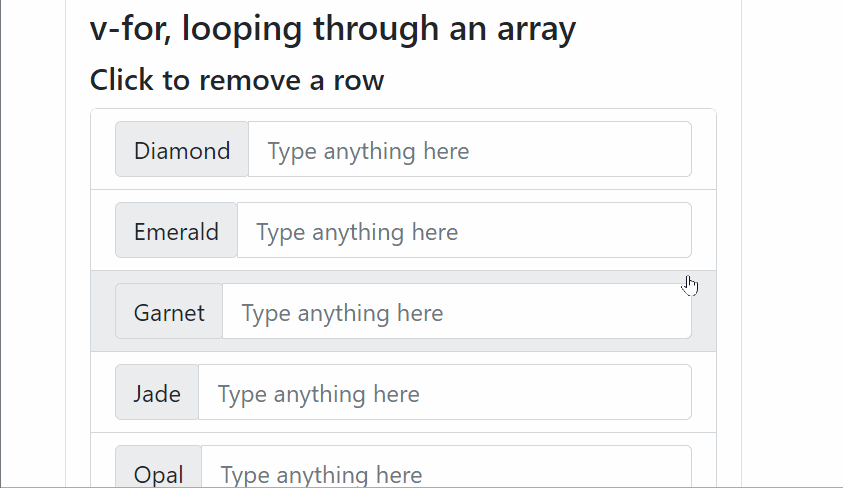

# About
## Objective
- To know the difference between `v-if` and `v-show`
- To know how `v-for` works and what `:key` is for

## Running the Demo
- Double click `index.html` to open the file in your default browser.

# Explanation
## Conditional Rendering: v-if, v-else-if, and v-else

- These directives are for *conditional rendering* -- elements are rendered in the DOM only if the condition is met.
- `
` renders the `
` if `isLower` is a truthy value. (`index.html`, line 43)
- `
` renders the `
` if `isHigher` is a truthy value AND its sibling `v-if` has a falsey value. (`index.html`, line 44)
  - `v-else-if` cannot stand alone. It needs a sibling element with a `v-if` directive.
- `
` renders the `
` if its corresponding sibling `v-if` and `v-else-if`s are all falsey. (`index.html`, line 45)
  - `v-else` cannot stand alone either. It needs at least a sibling element with a `v-if` directive.
- If you see the underlying code via Inspect Element, you'll notice that elements with the `v-if`, `v-else-if`, and `v-else` directives *disappear from the DOM* if the condition within it is falsey

## Conditional Display: v-show

- This directive is for *showing and hiding* an element (`index.html`, lines 70-72)
  - It is shown when the condition is met
  - However, it is hidden otherwise
- Differences with `v-if`
  - There is no `v-else-if` or `v-else` equivalent for `v-show`
  - Elements with `v-show` are not removed from the DOM when hidden
    - If you Inspect Element, you'll see a `style="display: none"` being added to the element.
- Performance:
  - `v-show` is slightly faster than `v-if`, because adding and removing DOM elements is more costly than slapping on a `display: none`
  - However, if you use `v-show` on everything, you'll end up with a bunch of elements you're not really using, so that's not ideal either
- So when do we use `v-show` instead of `v-if`? On elements whose *visibility is repeatedly toggled on and off*. 

## v-for

- This directive loops through an array or an object to display its elements.
- `v-for="gem in gemstones"` goes through each element in the array `gemstones`
- `v-for="(gem, index) in gemstones"` passes the `index` in addition to going through each element
  - The `index` starts with 0, and represents the order in which the element is present within the array
  - You can see this in action in `index.html`, lines 85-104
- `v-for="(value, key, index) in character"` passes the `key` and `index` while looping through each element in the `character` object
  - Note that `character` is *not* an array, but an `object`, with keys and values
  - `key` is the object's keys (e.g.: `element`, `species`)
  - `value` is the object's values (e.g.: `fire`, `badger`)
  - `index` represents the index (i.e. order within the array) of the object's key-value pair
  - You can see this in action in `index.html` in lines 108-128

## :key

- For efficiency and optimization, Vue *does not keep track* of the elements within the `v-for` loop, it instead only *stores index positions*. 
- To illustrate this, suppose we do the following
  - Remove the `:key="gem"` in `index.html` line 88.
  - Type in the number 10 inside the `<input>` beside "Diamond"
  - Type in the number 20 inside the `<input>` beside "Emerald"
  - Type in the number 30 inside the `<input>` beside "Garnet"
  - Click on the row that has the word, "Emerald"
  - We expect the input values, from top to bottom, to be 10 and 30 because we just removed "Emerald"
  - However, this is not the case, as 10, 20, and 30 are still visiable.
  - The GIF above illustrates this bug.
- `:key` fixes this bug, as it tells Vue that the elements within it should be kept track of.

# Further Reading
- Conditional rendering: https://vuejs.org/guide/essentials/conditional.html
- List rendering: https://vuejs.org/guide/essentials/list.html