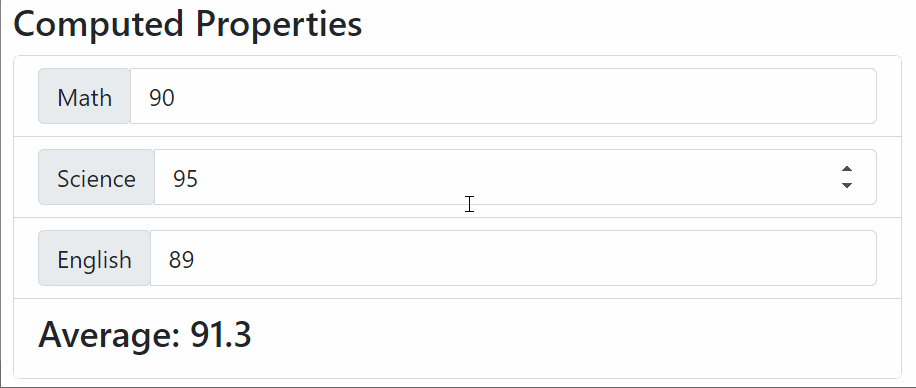
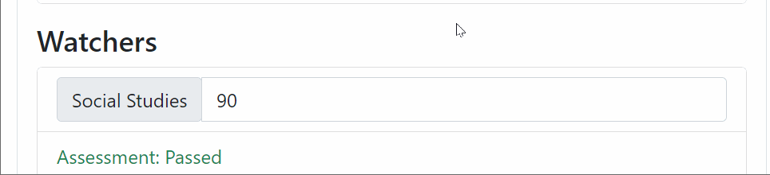
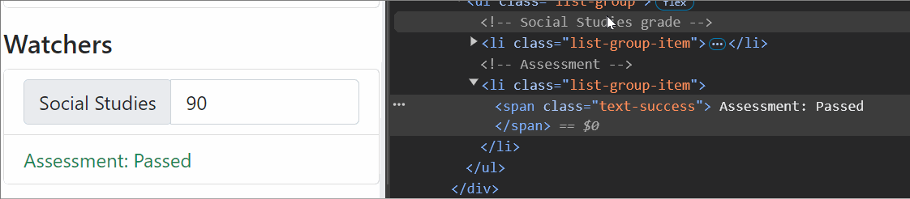

# About
## Objective
- To understand how computed properties work
- To understand how watchers work
- To understand how dynamic styling works

## Running the Demo
- Double click [index.html](./index.html) to open the file in your default browser.

# Explanation
## Computed Properties

- **Relevant files and lines:** 
  - [index.html](./index.html): Lines 23-86
  - [app.js](./app.js): 
    - `data()`: Lines 4-6
    - `computed`: Lines 13-19
- **Problem:**
  - Suppose we have a function surrounded by interpolation braces, like so: `{{ computeAverage() }}`
  - The function, `computeAverage()`, computes the average grade between three variables: `math`, `science`, and `english`
  - Whenever *any* property within `data()` changes, even if it's not `math`, `science`, and `english`, `computeAverage()` is called every single time
  - This results in unnecessary function calls, which can significantly slow down your application.
- **Computed Properties**:
  - This is where *computed properties* come in.
  - Computed properties are sort of like methods, but they are only executed whenever Vue detects a change in a property within it.
  - In other words, Vue takes note of the dependencies within computed properties, and executes it only when there is a change in the dependency.
  - In our example, lines 13-19 of [app.js](./app.js), The computed property `average()` is only triggered ONLY if
    - `this.math` changes, OR
    - `this.science` changes, OR
    - `this.english` changes.
  - Computed properties return a value that is *used for output*: `{{ average }}`
    - You can see this in line 84 of [index.html](./index.html)
    - Note that we are calling the computed property as a property (`{{ average }}`) and not as a function (`{{ average() }}`)

## Watchers

- **Relevant files and lines:** 
  - [index.html](./index.html): Lines 88-116
  - [app.js](./app.js): 
    - `data()`: Lines 7-8
    - `watch`: Lines 20-56
- **Watchers:**
  - Watchers are sort of like special functions that are:
    - Linked to a property in `data()`
    - and are executed only if the property changes
    - In Line 22 of [app.js](./app.js), `newValue` and `oldValue` are parameters that are automatically passed to watchers, which means that they don't need to be explicitly specified when called
    - In a practical setting, we usually just use `value` to represent `newValue`, and we don't use `oldValue` as much
  - In our example, [app.js](./app.js):
    - We have a data property called `socialStudies` (line 7)
    - We want to update `assessment` (line 8) and `assessmentClass` (line 9) based on the value of `socialStudies`
    - To do that, we use a watcher, `socialStudies()` (line 22), which does just that

## Dynamic CSS Classes

- **Relevant files and lines:** 
  - [index.html](./index.html): Lines 112
  - [app.js](./app.js): 
    - `data()`: Line 9
    - `watch`: Lines 35, 39, 43, 47
- **Dynamic Styling:**
  - Using v-bind, we can dynamically style DOM elements.
  - In [index.html](./index.html), line 112, we see this in action: ``
    - `assessmentClass` is an array of strings that hold class names
    - This array is modified dynamically based on the value of `socialStudies`, as seen in lines 35, 39, 43, and 47 of [app.js](./app.js)
  - While not shown in the example:
    - You may use computed properties to dynamically style a component, like so: 
      - ``
      - `computed: { boxProperties() { /* Insert logic here */} }`
    - Elements with both a constant CSS class and a dynamic CSS class can be written like so:
      - ``
      - Here, `bg-dark` colors the background of the element in a dark color.
      - `assessmentClass` is a dynamic data property which can be changed in Vue.

# Conclusions
- Methods: 
  - These are primarily used for *event binding*
  - "Do the following task whenever this button is clicked"
- Computed Properties:
  - These are primarily used for *data binding*: we bind data to be based on other data.
  - "Re-evaluate this property whenever one of its dependencies change"
- Watchers:
  - These are primarily used for *reacting*: we run a function whenever a property changes
  - "Call this function whenever this one property changes"

# Further Reading
- Computed Properties: https://vuejs.org/guide/essentials/computed.html
- Watchers: https://vuejs.org/guide/essentials/watchers.html