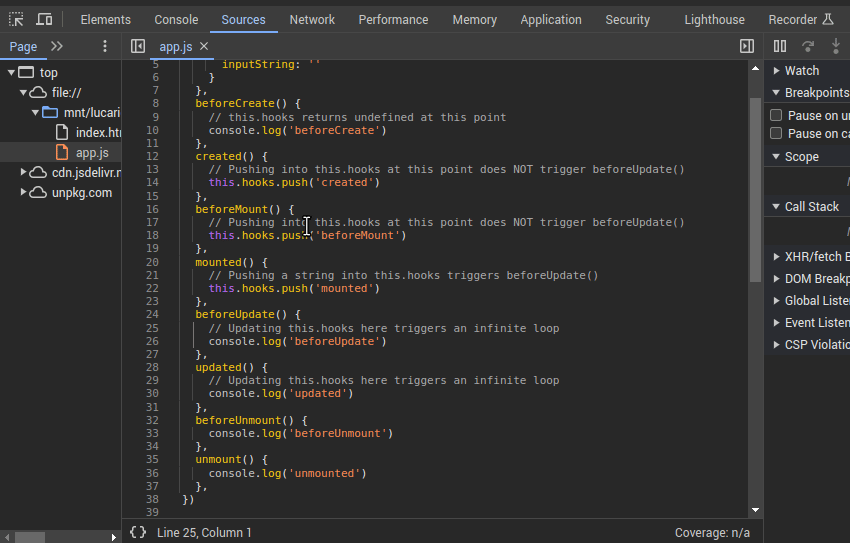
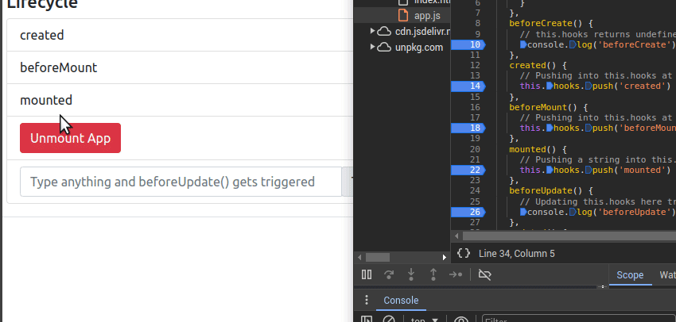
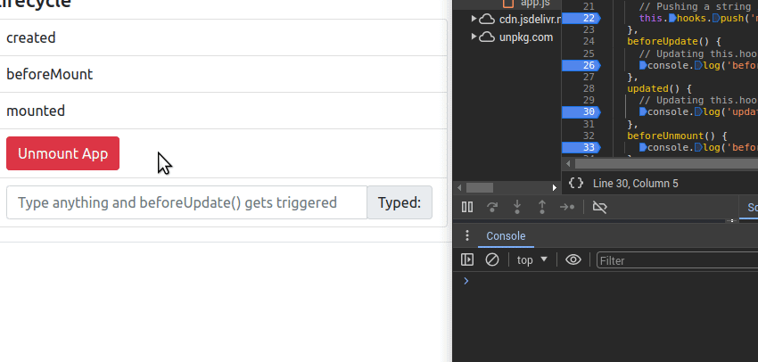
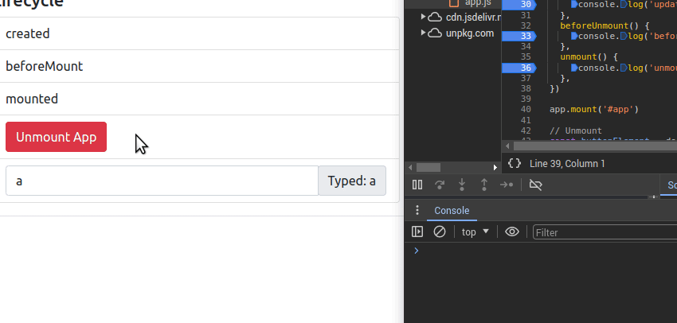

# About
## Objective
- To understand the Vue Instance Lifecycle

## Running the Demo
- Double click `index.html` to open the file in your default browser.

# Vue Instance Lifecycle
## Adding Breakpoints

- From your browser, right click and select Inspect (or Inspect Element)
- Click on the Sources tab
- On the left pane, click on `app.js`
- Click on the left side of the line numbers with `console.log` or `this.hooks.push()`

## Mounting

- This lifecycle is triggered when the template is mounted onto the app (`app.mount('#app')`)
- `beforeCreate()`: called before the app has been fully initialized
  - The `this` keyword is still not accessible at this point
- `created()`: called after the app has been fully initialized
  - At this point, the screen is stil blank, but `this` is now accessible
  - Updating data properties within `this` does not trigger `beforeUpdate()` at this point 
  - Vue is now aware of its data properties and general app configuration
  - Next, the template is compiled: All dynamic placeholders and interpolations are removed, and replaced with data properties and variables
- `beforeMount()`: called right before Vue displays things on the screen
- `mounted()`: everything is now properly displayed on the screen
  - Updating data properties within `this` now triggers `beforeUpdate()` from this point onwards. 

## Updating

- This lifecycle is triggered whenever some data is changed, and something within the page needs to be updated
- `beforeUpdate()`: called before the update has been fully processed. Vue is aware that something needs to be updated.
- `updated()`: called once the update has finished processing. At this point, the update has completed and is visible.

## Unmounting

- This lifecycle is triggered when the app is about to be set as inactive (i.e.: "killed"). Once inactive, all content is removed.
- `beforeUnmount()`: called when Vue is aware that the app is about to be unmounted.
- `unmounted()`: called when Vue is finished unmounting
