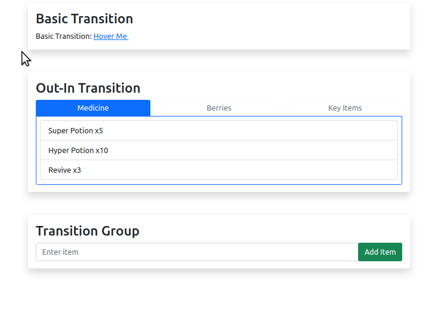
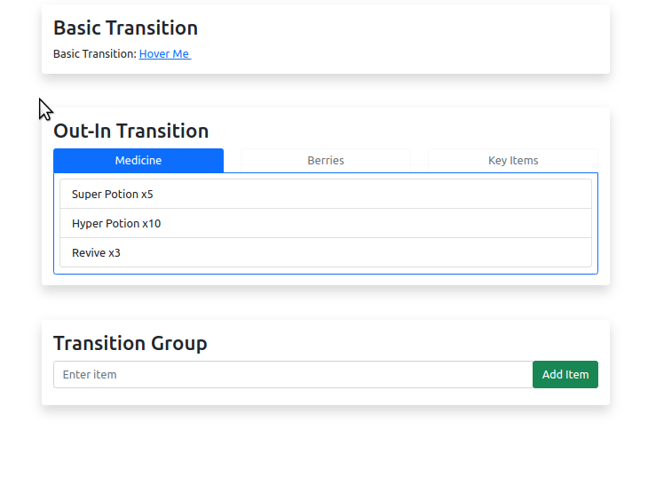

# About
## Objective
To learn about the Vue Transitions:
- A basic transition
- Transition class prefixes
- Transitioning multiple elements
- Transition Group

## Running the Demo
- Navigate to the `11-transition` directory in your command line
- Run `npm install` to install dependencies
- Run `npm run serve` to run the front end server

# Background
- The `<transition>` tag is Vue's way of simplifying and providing animation and transition effects to components.
- As an example, here is a small app without the use of `<transition>`



- Here is the same app, but with `<transition>`



# Transition
- You can see the `<transition>` tag in action in [BasicTransition.vue](./src/components/BasicTransition.vue), line 18:
  ```html
  <transition>
    <span
      v-if="isShowingTooltip"
      class="d-inline-block text-light bg-primary rounded ps-2 pe-2"
    >
      Tooltip information
    </span>
  </transition>
  ```
- The `<transition>` tag must only contain one direct child element underneath.
- The `<transition>` tag adds the following CSS classes on the child element, depending on its state:
  - The element is being added to the DOM, or is being shown:
    - `v-enter-from`: this class is added before the animation starts, and removed after the animation starts
    - `v-enter-active`: this class is added while the animation is playing, removed after the animation finishes
    - `v-enter-to`: added after the animation finishes
  - The element is being removed from the DOM, or is being hidden:
    - `v-leave-from`: this class is added before the animation starts, and removed after the animation starts
    - `v-leave-active`: this class is added while the animation is playing, removed after the animation finishes
    - `v-leave-to`: added after the animation finishes
- Since CSS classes are being added and removed thanks to the `<transition>` tag, you can add the following CSS classes to animate, as seen in [BasicTransition.vue](./src/components/BasicTransition.vue), line 30:
  ```css
  .v-enter-active,
  .v-leave-active {
    transition: opacity 0.3s ease;
  }

  .v-enter-from,
  .v-leave-to {
    opacity: 0;
  }
  ```
- In this case, we are pretty much setting up the following rules:
  - As the element appears into the DOM, and before the animation starts, the element should be invisible (`opacity: 0;`)
  - As the element appears into the DOM, and while the animation is playing, we need to manipulate its opacity in 0.3s using the `ease` timing function
    - `ease` means that the animation starts slowly, speeds up in the middle, and then slows down again towards the end
  - As the element disappears from the DOM, and while the animation is playing, we manipulate its opacity in 0.3s using the ease timing function
  - As the element disappears from the DOM, and after the animation finishes, the element should be invisible.
- Alternatively, it is possible to define an animation and just use that in the `-active` classes, like so:
```css
.v-enter-active {
  animation: fade-in 0.3s ease-out;
}

@keyframes fade-in {
  from {
    opacity: 0;
  }
  to {
    opacity: 1;
  }
}
```
- Side note: you'll notice that in line 29 of [BasicTransition.vue](./src/components/BasicTransition.vue), we are using, `<style lang="scss" scoped>`
  - `lang="scss"` means that we are using [SCSS](https://www.geeksforgeeks.org/what-is-the-difference-between-css-and-scss/) instead of CSS.
  - `scoped` means that the styles defined within this block only applies locally within the Vue file.

# Transition Class Prefix
- The classes that are being automatically added, `v-enter-from`, `v-enter-active`, `v-enter-to`, etc., can be changed.
- To change just the prefix (the `v-` part), you can use the property, `name`. You can see this in action in [OutInTransition.vue](./src/components/OutInTransition.vue), line 47.
  ```html
  <transition name="slide" mode="out-in">
  ```
- The `name="slide"` portion changes the prefix of the classes, like so:
  ```css
  .slide-enter-active,
  .slide-leave-active {
    transition: opacity 0.2s ease;
  }

  .slide-enter-from,
  .slide-leave-to {
    opacity: 0;
  }
  ```

# Transitioning Multiple Elements
- We mentioned that the `<transition>` tag must only contain one direct child element underneath.
- However, there is one exception where multiple child elements are allowed, as seen in [OutInTransition.vue](./src/components/OutInTransition.vue), line 47 onwards:
  ```html
  <transition name="slide" mode="out-in">
    <span v-if="selectedTab === 'medicine'">
      <!-- Medicine content -->
    </span>
    <span v-else-if="selectedTab === 'berries'">
      <!-- Berry content -->
    </span>
    <span v-else>
      <!-- Key items content -->
    </span>
  </transition>
  ```
- Note that in the above, while it looks like there are three direct child elements, only one is rendered in the DOM thanks to the `v-if`s; therefore, this is fine.
- Another thing to note is the `mode` property, as this has two possible values:
  - `in-out`: The addition of the element is animated first, and *then* the existing element is removed.
  - `out-in`: The existing element is removed first, and *then* the new element is animated in

# Transition Group
- `<transition-group>` is just like `<transition>`, but it is capable of animating multiple elements.
- This can be seen in action in [ItemListAdder.vue](./src/components/ItemListAdder.vue), line 43 onwards
  ```html
    <TransitionGroup tag="ul" class="list-group mt-2" name="list">
      <li class="list-group-item" v-for="item in items" :key="item">
        <!-- Display the item here -->
      </li>
    </TransitionGroup>
  ```
- Note that the `<transition>` tag only adds certain classes to its lone child element; however, `<transition-group>` actually adds a new element into the DOM.
  - In this case, it is a `<ul>` element with the classes, `"list-group mt-2"`.
  - It also accepts the same properties as `<transition>`, which means that properties such as `name` or `mode` can be used