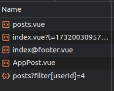
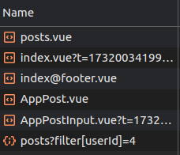
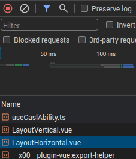
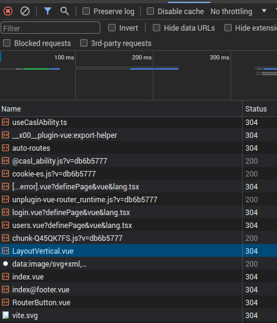
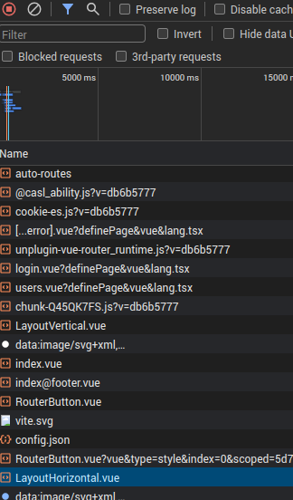

# About
## Objective
To learn how to optimize your Vue App

## Running the Demo
- Navigate to the `17-optimization` directory in your command line
- Run `npm install` to install dependencies
- Run `npm run dev` to run the front end server
- Run `npx tsx fake-api-server.ts` to run the backend server

# Setup
## Project
These were the commands I ran to start `17-casl`. You don't have to run them anymore, but these commands may be helpful to those who would like to setup a project that has the following libraries:

```bash
npm install lodash --save
npm install @types/lodash --save-dev
```

This project is a continuation of the previous one, so for this project to work, feel free to have a look at [../15-stores/README.md](./../15-stores/README.md) and install the appropriate packages.

# Optimization
## About
Let's look into a summary of common optimization techniques in Vue:
- State Management:
  - Using Pinia instead of VueX as Pinia is lighter and faster
  - Avoiding using Pinia for variables that aren't site-wide
  - We are already doing this
- Avoid Unnecessary Renders:
  - Use v-if to conditionally render components instead of v-show
  - Use the `:key` prop to manage re-renders when doing list iteration
  - We are already doing this
- Optimizing Assets:
  - Use Vite to minify and compress JavaScript, CSS, and images
  - We are already doing this
- Memoization:
  - Use computed properties, or libraries like VueUse to memoize values
  - This avoids expensive recalculations, and only recalculates when a dependency changes
  - We are already doing this
- Optimizing Event Handlers:
  - Debounce or throttle frequent events (e.g., scroll, resize).
  - We'll add a search bar in the user list to illustrate this example.
- Prefetching
  - Pre-fetch components or routes when you are absolutely certain that a user will navigate to them soon.
  - We'll pre-fetch the `AppPostInput.vue` component within the `/post/index` page to illustrate this example.
- `defineAsyncComponent()`
  - Tells Vue not to load a component on initial load
  - Instead, load it only when needed
  - We *will* be making a few changes to use `defineAsyncComponent` in `17-optimization`

# Optimization Details
## Memoization
Don't do this:
```html
<template>
  <div>
    <input v-model="celsius" />
    <p>Result: {{ calculateFahrenheit() }}</p>
  </div>
</template>
```

Instead, do this:
```html
<template>
  <div>
    <input v-model="celsius" />
    <p>Result: {{ fahrenheit }}</p>
  </div>
</template>
```
```js
const celsius = ref(0)
const fahrenheit = computed(() => {
  return 1.8 * celsius.value + 32
});
```

Reasoning:
- Memoization makes sure that calculations are only performed *when its dependent data changes*
- In the first unoptimized example, `calculateFahrenheit()` is called on every render, even when `celsius` isn't changed, which causes unnecessary recalculations. 

## Optimizing Event Handlers
- An example of this in action can be seen in [users.vue](./src/pages/users.vue)
```html
<input
  type="text"
  class="form-control"
  placeholder="Search user"
  v-model="searchString"
  @input="searchUsers"
/>
```
```javascript
// The following code is unoptimized
const searchUsers = (event) => {
  const username = event.target.value
  userSearchResults.value = allUsers.value.filter(user => user.username.includes(username))
}

// The following code is optimized
const debounceTimerMs = 300 // Execute the function after 300ms of no input
const searchUsers = debounce((event) => {
  const username = event.target.value
  userSearchResults.value = allUsers.value.filter(user => user.username.includes(username))
}, debounceTimerMs)
```
- Without `debounce()`, `searchUsers()` gets triggered on every key press, which leads to unnecessary function calls.

## Prefetching 
- An example of this in action can be seen in [posts/index.vue](./src/pages/posts/index.vue)
```javascript
const prefetchInputComponent = () => import('./../../components/AppPostInput.vue')
prefetchInputComponent()
```
- To see if the AppPostInput.vue is being pre-fetched:
  - Go to the Developer Tools (Inspect Element)
  - Go to the Network tab.
- If the `prefetchInputComponent()` is commented out, then the Network tab will look like the following:

  

- However, if it is being called, then the Network tab will look like the following:

  

## `defineAsyncComponent()`
- Some components are only used in very specific places, and not in the entire app.
  - This means that the source code of some components do not need to be downloaded all the time.
  - This causes a problem: the user downloads way too much code than needed.
  - We want users to only download what is needed, thereby making the app load faster.
  - Therefore, we would want to load some components *lazily*.
- We can achieve lazy-loading components via `defineAsyncComponent()`:
  - This function tells Vue to *not* download the source code of a component on first load.
  - Instead, do it only when it is needed.
- Consider the following code within [App.vue](./src/App.vue) 
  ```html
    <!-- Lines 113 to 124, but only the important parts -->
    <!-- We have a checkbox to specify if the user wants a horizontal or vertical layout -->
    <input v-model="isLayoutVertical" type="checkbox">
    <label>
      {{ isLayoutVertical ? 'Vertical' : 'Horizontal' }}
    </label>
    
    <!-- Lines 131 to 137, but only the important parts -->
    <!-- We then use the information from the checkbox to load the appropriate component -->
    <Component :is="isLayoutVertical ? LayoutVertical : LayoutHorizontal">
  ```
- In order to use `LayoutVertical` and `LayoutHorizontal`, we needed to import them like so:
  ```javascript
  // The following code imports them as is, without using defineAsyncComponent
  // Importing them like this tells Vue to download BOTH LayoutVertical and LayoutHorizontal
  // even though the user won't really need both, as they would most likely just use one or the other
  import LayoutVertical from './components/LayoutVertical.vue'
  import LayoutHorizontal from './components/LayoutHorizontal.vue'
  ```
  - You can see the browser loading both components by going to the Network tab and reloading the page with the above code, like so:

    

  - You'll notice how both `LayoutVertical` and `LayoutHorizontal` components are being loaded.

- However, it is possible to load only one of the components using `defineAsyncComponent()`, like so:
  ```javascript
  // The following code imports them using defineAsyncComponent()
  const LayoutVertical = defineAsyncComponent(() => import('./components/LayoutVertical.vue'))
  const LayoutHorizontal = defineAsyncComponent(() => import('./components/LayoutHorizontal.vue'))
  ```
  - Doing so makes it so that they are loaded on demand. You can confirm this by checking out the network tab.
  - The following is a list of what is loaded on first load. Notice how LayoutVertical is loaded, but LayoutHorizontal is absent.

    

  - Then, upon toggling the checkbox, the LayoutHorizontal is loaded.

    

- Thus, with `defineAsyncComponent()`, we are able to load components only when needed.


# Further reading
- Async Components: https://vuejs.org/guide/components/async.html
