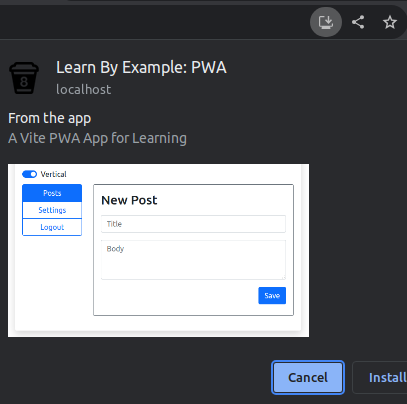
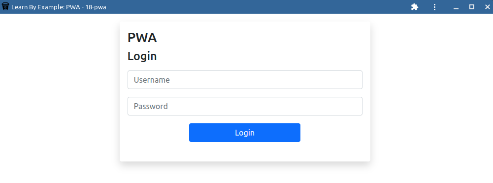

# About
## Objective
To learn how to turn your app into a PWA

## Running the Demo
- Navigate to the `18-optimization` directory in your command line
- Run `npm install` to install dependencies
- Run `npm run dev` to run the front end server
- Run `npx tsx fake-api-server.ts` to run the backend server

# Setup
## PWA Basics
### What's a PWA?
- Progressive Web Application
- Uses web capabilities to provide an experience similar to native mobile apps.

### Key Features
- **Installable**
  - Works on any device and feels like a native app
  - Can be added to home screenw without the need to go to the App/Play Store
- **Reponsive**: adjusts to various screen sizes
- **Connectivity-Independent**: can work offline using service workers
- **Updatable**: version can be updated using service workers

### Access Capabilities
- PWAs can access the following device features (as of Dec 2024):
  - Fully available:
    - Basics:
      - Local File Caching (Cache API)
      - Real-time Communication (WebRTC API)
      - Low-Level Audio (Web Audio API)
      - Network Communication (Fetch API/WebSocket API)
      - 2D Canvas Rendering (Canvas API)
    - Hardware/Sensors:
      - Geolocation (GPS)
      - Camera/Microphone (Media Devices Interface)
      - Sensors (accelerometer, gyroscope, magnetometer, etc., using the Sensors API)
      - Touch/Pointer Access
      - Gamepads (Gamepad API)
      - Biometric Authentication (Face/fingerprint recognition using Web Authentication/Web Authn) 
    - OS Integration:
      - Speech Synthesis and Voice Recognition (Web Speech API)
      - Content Sharing from PWA to other apps (Web Share API)
      - Clipboard Access (Clipboard API)
      - Credential Management (Credential Management API)
      - Picture-in-picture Video Playing (Picture-in-picture API)
      - Fullscreen Integration (Fullscreen API)

  - Available on some browsers:
    - Basics:
      - WebGL 2.0 (for matching with OpenGL 3.0)
      - Codecs for access to individual video frames (Web Codecs API)
    - Hardware/Sensors:
      - Advanced Camera Controls (pan/tilt/zoom/etc)
      - Bluetooth Low Energy (Web Bluetooth API)
      - NFC (WebNFC API)
      - Serial Peripheral (Web Serial WPI)
      - USB Device Access (WebUSB API)
      - Human Interface Devices (WebHID API)
      - Ambient Light Sensor (Sensors API)
      - Vibration (Vibration API)
      - Recording Media (MediaRecorder API)
      - Wake Lock which prevents device from dimming the screen (Screen Wake Lock API)
      - Virtual Reality Headset (WebXR Device API)
      - Augmented Reality (WebXR Device API)
      - Inactive User Detection (Idle Detection API)
      - Orientation Lock locks the device to portrait/landscape (Screen Orientation API)
      - Present Content on Projectors (Presentation API)
      - Pointer Lock Detection to receive delta movement from pointers, like from mice or trackpads (Pointer Lock API)
    - OS Integration:
      - File System Read/Write Access (File System Access API)
      - Content retrieval from other apps (Web Share Target)
      - Contact Information retrieval (Contact Picker API)
      - Sync in the background while PWA is not used (Background Synchronization API)
      - Task scheduling while PWA is not used (Web Periodic Background Synchronization API)
      - **Notifications** (Web Push, Web Notifications API)
      - File Transfer in background while PWA is not used (Background Fetch API)
      - Media player integration (Media Session API)
      - Payment management (Payment Request API, Apple Pay JS Library)
      - Query Network Status: connection type (4G/3G), etc. (Network Information API)
      - Capture User's Screen (Screen Capture API)
      - Detect shapes like barcodes, QR codes, faces, etc. (Shape Detection API)
      - Device Memory Information (Device Memory Interface)
      - One-time Passwords over SMS (WebOTP API)
      - Virtual Keyboard Management (Virtual Keyboard API)
- The capabilities that are in **bold** are the ones we'll try to integrate into our web app as a demo.

## Turning this app into a PWA: step by step
1. Install plugin
    ```bash
    npm install vite-plugin-pwa --save-dev
    ```
2. Configure the PWA plugin within [vite.config.ts](./vite.config.ts): see `plugins.VitePWA()`
3. Create the service worker: See [serviceWorker.ts](./src/serviceWorker.ts)
4. Create the service worker registration file: See [registerServiceWorker.ts](./src/registerServiceWorker.ts)
5. Add registerServiceWorker into [main.ts](./src/main.ts), like so:
    ```typescript
    // PWA: Register Service Worker
    import './registerServiceWorker'
    ```
6. Add the icons. See [./public/icons/](./public/icons/)
7. Build the app
    ```bash
    npm run build
    ```
    - Note: `npm run build` is supposed to run both `vue-tsc -b` and `vite build` (See [package.json](./package.json))
    - However, `vue-tsc` does not work with the current version of TypeScript (5.7.2).
    - Therefore, I've removed `vue-tsc -b` for now. 
    - See https://github.com/vuejs/language-tools/issues/5018 for more details.
8. Starts a local web server which serves the built solution from `./dist`
    ```bash
    npm run preview
    ```
9. If everything is done correctly, then the website should be *installable*, as seen in the screenshots below:



## PWA with Push Notifications

# Further reading
- PWA Capabilities: https://web.dev/learn/pwa/capabilities/
- PWA Richer Install UI: https://web.dev/patterns/web-apps/richer-install-ui/
- PWA Demos: https://whatpwacando.today
- Icon source: https://www.iconarchive.com/show/windows-8-icons-by-icons8/Very-Basic-Icons8-Cup-icon.html